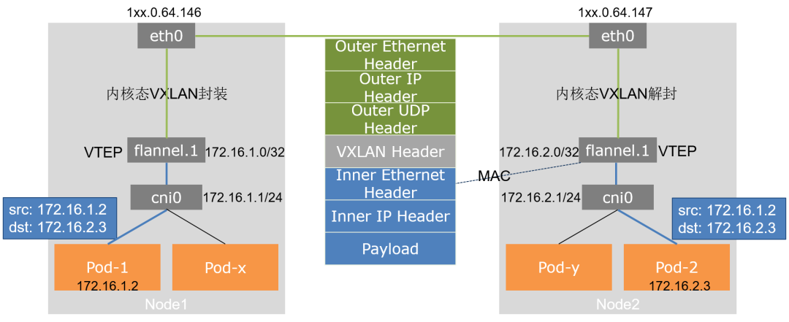
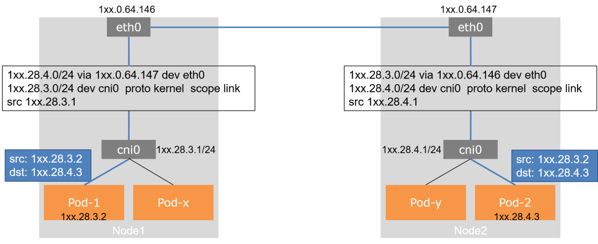

## K8S
    主机、网络、存储
    POD、SERVICE

[入门教程](https://kuboard.cn/learning/)
[官方教程](https://kubernetes.io/zh/docs/setup/production-environment/tools/kubeadm/create-cluster-kubeadm/)

## 安装、使用
<del>可使用sealos快速部署</del>

[k8s基于centos7安装(谨慎操作，本文档会销毁覆盖之前集群)](./k8s-centos7.md) 

[dashboard部署](./dashboard.sh)   

[ingress-nginx部署](./ingress-nginx.sh)   

[keepalived-haproxy部署](./install_keepalived_haproxy.sh)   

[Jenkins服务部署](./yml/jenkins.yaml)   

[测试--服务部署](./yml/ns-dev-web.yaml)   

[daemonset概念](https://kubernetes.io/docs/concepts/workloads/controllers/daemonset/)

[yaml语法](https://www.runoob.com/w3cnote/yaml-intro.html)
    
## 主机Node
    master管理节点、worker工作节点
    添加新节点、下线坏节点

## 网络
    1、了解。Overlay网络，容器网络的IP和MAC地址对宿主机网络不可见，跨宿主机容器间通信需要将容器流量进行封装转发，而容器出集群的流量需要进行SNAT转换
    2、推荐。扁平化的Underlay网络，容器网络对宿主机可见，在容器进行通信时不需要对流量进行封装，直接建立路由表，根据规则进行路由转发进行通信
    Flannel的host-gw模式、Calico的BGP模式
    
1、Node IP
    
    物理(或虚拟)主机自身的原来网络，Node间通信。在k8s集群之前存在

2、Service IP
    
    k8s集群中，虚拟网络，service 通过kube-proxy配置为iptables/ipvs规则，把流量发往后端的Pod上
    默认模式为ClusterIP，仅集群内部通讯
    NodePort模式
    每个Service都会在所有的Node节点映射一个随机端口，外部可以通过http://任一NodeIP:NodePort即可访问内部服务。或者使用ingress

3、Pod IP 和 Container IP
    
    k8s集群中，虚拟网络，设置各Pod的IP以及Pod间通信，通过CNI插件实现
    同Pod不同容器间，通过localhost 127.0.0.1，默认互通
    同Node不同Pod间，通过docker0，默认互通
    不同Node不同Pod间，需CNI网络插件借助Node，Pod1 --> Node1 --> Node2 --> Pod2

参考下图，跨Node的Pod间通信，flannel-vxlan

跨Node的Pod间通信，flannel-host-gw

## 外部服务
    Kubernetes内外服务相互访问
    外部访问集群内服务，通过Ingress(ingress-nginx Daemonset模式)代理，支持http(s)、tcp/udp
    集群内访问外部服务，通过Endpoints转发

    跨namespace与Service通信，通过Service的ExternalName类型

## 存储
    emptydir、hostPath、pvc
### emptydir
    大部分应用适用该类型，随POD一起创建、消亡
### pvc
    共享文件   
    cephfs、glusterfs、nfs

## 日志
    efk 通过daemonset或者carside来搜集集群日志
